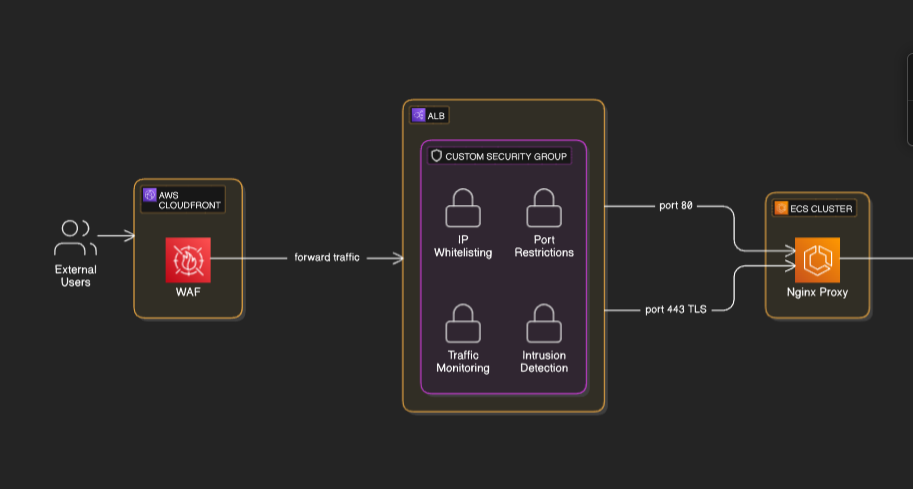

# AWS Network Traffic Expose 

This diagram showcases ECS cluster running container tasks exposed via load balancer 443 port using custom CA certificate stored in AWS Private Certificate Authority and custom SSL certificate generated for Load Balancer. Load Balancer of type Application has Web Application Firewall (AWS WAF) and CloudFront distribution enabled custom security group. 

- **Target group stickiness**
When stickiness is enabled, the load balancer assigns a cookie (either its own or an application-generated one) to a client’s first request. Subsequent requests from that client include the cookie, and the load balancer uses it to route the request to the same target that handled the initial request. This continues until the cookie expires or is removed. Benefits - Session Persistence and Improved User Experience, also you ensure that users maintain a continuous and consistent session experience, which is particularly important for stateful applications.

# Recommended AWS WAF Rules:
- **AWSManagedRulesCommonRuleSet**
Provides protections against common web exploits including SQL injections and cross-site scripting (XSS).

- **AWSManagedRulesSQLiRuleSet**
Protects against SQL injection attacks.

- **AWSManagedRulesCrossSiteScriptingRuleSet**
Mitigates XSS attacks.

- **IP Reputation and Anomaly Detection:**
AWSManagedRulesAmazonIpReputationList – Blocks or limits requests coming from IP addresses associated with known malicious behavior.

- **Core rule set**
Contains rules that are generally applicable to web applications. This provides protection against exploitation of a wide range of vulnerabilities, including those described in OWASP publications.  

- **Known bad inputs**
Contains rules that allow you to block request patterns that are known to be invalid and are associated with exploitation or discovery of vulnerabilities. This can help reduce the risk of a malicious actor discovering a vulnerable application

- **Linux operating system**
Contains rules that block request patterns associated with exploitation of vulnerabilities specific to Linux, including LFI attacks. This can help prevent attacks that expose file contents or execute code for which the attacker should not have had access

- **SQL database**
Contains rules that allow you to block request patterns associated with exploitation of SQL databases, like SQL injection attacks. This can help prevent remote injection of unauthorized queries

# Other:
- **Content Size and Method Validation**
Use custom rules to ensure that the request body size, HTTP methods (e.g., only allow GET/POST), and headers conform to your expected patterns. This minimizes the risk of exposing your backend to oversized or unexpected payloads.

- **Custom Rate-Based Rules**
Enforce limits on the number of requests from a single IP or IP range to help mitigate DDoS or brute-force login attempts. AWS Shield might help with that also.

