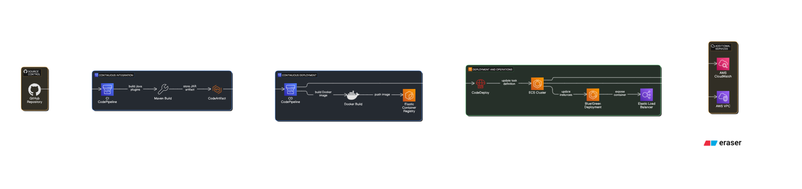

# AWS CI/CD Project for blue-green cloud deployments
Below is an overview of your CI/CD project (based on CodeBuild, CodeDeploy and Codepipeline AWS services) that orchestrates the build, test, and deployment of both a Java application (stored as artifact in CodeArtifact) and a Docker container (stored in ECR) onto Amazon ECS using blue-green deployment approach.. 

- **CI/CD diagram/**

## Project overview:
- **AWS CodePipeline**  
Orchestrates end-to-end workflows for both the Java and Docker applications.
Stages include Source retrieval (from GitHub via webhooks), Build, Manual Approval, storing java artifacts in Code Artifact, pushing docker images to container registry and triggering blue/green deployments.

- **AWS CodeBuild**  
For the Java app: Uses a buildspec.yml to run a Maven build (using settings.xml and pom.xml) to compile and package the application into a JAR file.
For the Docker app: Builds a Docker image from a Dockerfile, tagging and pushing it to Amazon ECR. 
Retrieves authorization tokens (via CodeArtifact) for dependency management and artifact distribution. Docker has "caching" functionality enabled according to docker-building best practices in order to ensure quick and predictible, constant docker environments and images.

- **AWS CodeDeploy**  
Manages blue/green deployments for the Docker application on ECS.
Utilizes an appspec.yml file to define target services on ECS and to override task definitions (not image definition as for 'normal', not blue-green deployment) during deployment. Works via "CodeDeployToECS" provider and not "ECS (as for 'normal', not blue-green deployment)" in order to ensure project requirements.

- **Amazon ECS (Elastic Container Service)**  
Hosts the deployed Docker container as part of an ECS service.
Defines an ECS cluster, task definition, and associated service that uses Fargate (serverless container hosting) along with a load balancer for distribution of traffic.

- **Amazon ECR (Elastic Container Registry)**  
Stores Docker images built by CodeBuild.
Provides a centralized repository that feeds the ECS-based deployment.

- **AWS CodeArtifact**  
Acts as a Maven repository to store and retrieve Java build artifacts.
Integrated with CodeBuild (via authentication tokens from aws codeartifact get-authorization-token) to enable secure publishing and dependency resolution.

---

## Other Important Aspects

- **Multi-Pipeline Architecture**  
The project defines separate pipelines for Java and Docker applications, ensuring that each technology stack is built and deployed via its tailored process.
Each pipeline includes well-defined phases for source code retrieval, build execution, artifact storage, manual approvals, and automated deployments.

- **Java Application Build and Deployment**  
Source Code & Dependencies: The Java project (located in the java-app directory) uses Maven for its build process, as defined by the pom.xml and settings.xml files.
Build Lifecycle: The buildspec.yml file orchestrates the Maven build, including steps to validate the Maven version, run SonarQube scanning (if enabled), and deploy the final JAR artifact to AWS CodeArtifact.
Artifact Distribution: The Maven project is configured with a CodeArtifact repository, ensuring that dependencies and build artifacts are managed securely.

- **Docker Application Build and Blue/Green Deployment**  
Docker Image Creation: The buildspec.yml for the docker-app executes Docker commands to build, tag, and push the Docker image to Amazon ECR.
Deployment Strategy: CodeDeploy performs blue/green deployments to an ECS service. The appspec.yml details the ECS service integration by referring to an ECS task definition (defined in taskdefinition.json) and load balancer settings.
Load Balancing: An Application Load Balancer (ALB) directs traffic appropriately between blue and green environments, minimizing downtime during deployment rollouts.