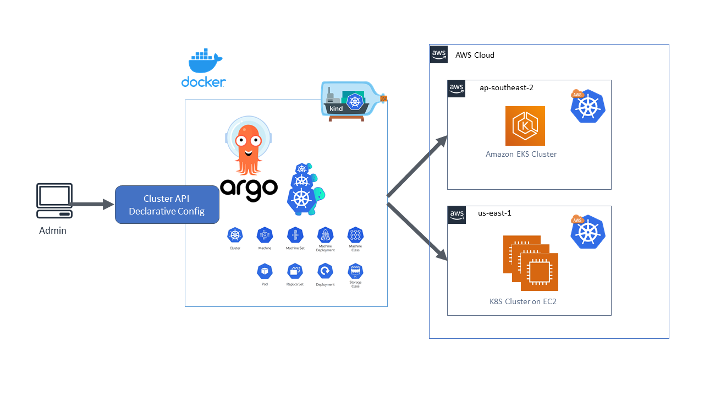

# GitOps project inside AWS 

Argo CD is a declarative, GitOps continuous delivery (CD) tool designed specifically for Kubernetes, including Amazon EKS clusters. In general, Argo CD continuously monitors a Git repository that contains Kubernetes manifest files. Any change pushed to the repository is automatically detected and deployed to your EKS cluster, ensuring that your cluster’s state matches your declared configuration in Git. Here’s an overview of its key concepts and how it works:

In summary, Argo CD brings consistency, transparency, and automation to the CD process for EKS clusters on AWS by enabling a Git-based workflow for managing and deploying Kubernetes resources.

Access to EKS Cluster:
1. via aws-auth ConfigMap (mapRoles or mapUsers section) -> deprecated, now "EKS access entries" is recommended approach -> you can use eksctl to manage access entries.
2. via "bootstrapClusterCreatorAdminPermissions" flag during setup

Concept of ArgoCD:

# Applications: 
- An Application in Argo CD represents a single deployment unit—essentially, a group of Kubernetes manifest files (could be also Helm charts) that are stored in a Git repository and define the desired state of your application.
- It specifies the source (Git repo URL, path, and branch/tag), the destination (target cluster and namespace), and the sync policies (automated or manual deployment, retry behavior, etc.).
- The Application controller continuously monitors the Git repository and reconciles the live cluster state with the desired state declared in the Application.

# Other Core Components:
- API Server: Exposes Argo CD’s REST API and the web UI, allowing you to interact with and monitor your Applications.
- Repository Server: Manages cloning and rendering Git repositories, which includes processing the necessary tools (like Helm or Kustomize) to generate the Kubernetes manifests.
- Application Controller: Responsible for the continuous reconciliation loop. It watches for changes in your defined Applications and makes sure that the state running in your cluster aligns with what’s defined in Git.
- Dex or Other OIDC Providers: Often used for authentication, these integrate with Argo CD to provide secure access control.

# Description of this project:
1. Create EKS cluster using "eksctl" command and "eksctl.yaml" config file. Config file includes:
- enabling eks add-ons
- OIDC to enable add-ons
- privateCluster
- declared k8s cluster version
- bootstrapClusterCreatorAdminPermissions to manage k8s cluster

2. Create ArgoCD github connection:
3. Create ArgoCD remote-cluster connection:
3. Create ArgoCD Application:

---

aws eks update-kubeconfig --region us-east-1 --name priv-cluster-argocd
aws eks update-kubeconfig --region us-east-1 --name prod
aws sts get-caller-identity
kubectl config get-contexts
kubectl config use-context arn:aws:eks:us-east-1:703671893205:cluster/priv-cluster-argocd
kubectl config use-context arn:aws:eks:us-east-1:703671893205:cluster/prod

22kRkYXXUgxq7zhh
stworzyć drugi klaster w osobnym VPC
skonfigurować transit gateway między VPC i poprawne "routes" w ramach Transit Gateway route table
skonfigurować security group dla EKSa żeby zezwalał na ruch z drugiej sieci (i na odwrót) -> tego nie trzeba o ile zezwoli się na poziomie EC2 ...
... skonfigurować SG na EC2 należących do EKSa żeby zezwalał na ruch z drugiej sieci (i na odwrót)
... nie działało mi połaczenie na 443 na MASTER NODE'Y IP (bo do nich się łączymy a nie na workery!!!)
^dlatego trzeba otworzyć SG na ten ruch ale na tych SG przypsianych do EKS!
...
dodać w subnetach EC2 (czyli te same co EKS) route na drugą sieć na "target" "Transit Gateway"
dodać jeszcze VPC endpoint na EKS do obu sieci???
aws eks update-kubeconfig -> to dodaje context nowy na klaster
-> ten context używamy potem:

argocd cluster add <remote-cluster-context>
^to tworzy connection
ale trzeba się najpierw zalogować:
argocd login $url:443 --username admin --password $pass

argocd app create my-app \
  --repo https://github.com/LeajD/AWS-Projects.git \
  --path apps/my-prod-argocd \
  --dest-server https://EAAEBB42098EC281A1C2F04DAE99C79F.gr7.us-east-1.eks.amazonaws.com \
  --dest-namespace default
^path to ścieżka na gicie do manifestów

argocd app sync my-app --resource apps:Deployment:nginx-deployment
kubectl -n argocd get secret argocd-initial-admin-secret -o jsonpath="{.data.password}"

+ nat gateway żeby pody (np tego przykladowego nginx'a) pobrały się

