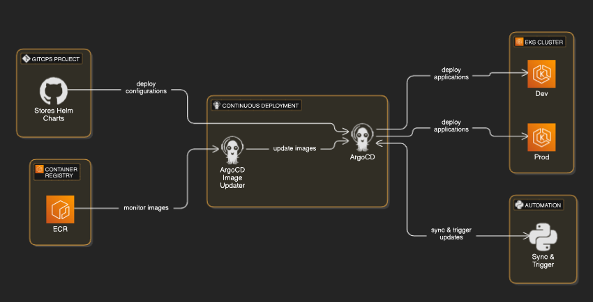

# GitOps project with python and Pull Request 

This project showcases a robust GitOps pipeline on AWS, combining automated infrastructure provisioning, continuous delivery through Argo CD, dynamic image updates, and Git-based management of Kubernetes deployment manifests and Helm charts using Pull Requests and merging of branches. 

- **ArgoCD** deploys "app of apps" pattern to bootstrap both dev and prod applications
- **argocd-image-updater controller** runs in EKS cluster and periodically checks the specified container registry (ECR) for new image tags on "dev" environment. It applies your defined semver strategy to determine if a new image qualifies as an update.
- **Git Write-Back** When a new image tag is detected that meets your criteria, the updater automatically updates the Git repository that holds your application's Helm chart configuration
- A custom Python script (`gitops.py`) leverages the PyGithub library to automate Git operations. This script enables creation of pull requests based on "dev" environment workloads to merge them into "prod" environment. 

# Python script (gitops.py): (can be integrated as part of Jenkins CD or manually)
1. Allows to freeze "dev" by implementing (using Pull Requests) "ignore-tags" annotations policy in "argocd-image-updater" to disallow any changes to ensure stable environment for QA teams and simulate "staging" stage of environment.
2. Since production ArgoCD Application doesn't have argocd-image-updater enabled this script allows to "push" new versions of application from "dev" to "prod" clsuter after testing phase. It uses Pull Requests and merging of those changes.
// if new Merge breaks application - you can quickly revert last Pull Request
3. "Resume" function in script allows "dev" environment to allow deployment of new versions to prepare for next deployment into production.

Project is based on following guideline:
https://github.com/antonputra/tutorials/tree/main/lessons/200

# Project Structure Overview:
- apps/: Contains environment folders (dev, prod) with per-service ArgoCD application definitions.
- apps/helm-charts/: Contains Helm charts for different services (payments, users), which are used for demonstrate Continuous Delivery approach via Argo CD and python script.
- argocd/: Stores secrets and configuration for Argo CD, ensuring secure access to Git repositories.
- myapp/: Holds the source code of a sample application (with a Dockerfile and Python code).
- terrraform/: Contains all Terraform modules and state for AWS resource provisioning (EKS, node group, EKS addons, argocd chart, ECR, image-updater chart).

# Annotations and Configuration:
ArgoCD application is annotated to tell argocd-image-updater which container image to monitor and what update strategy to use (semantic versioning):

argocd-image-updater.argoproj.io/image-list: users=$ID.dkr.ecr.us-east-1.amazonaws.com/users
argocd-image-updater.argoproj.io/users.update-strategy: semver
argocd-image-updater.argoproj.io/write-back-method: git

To pause CD inside ArgoCD Application we apply following annotations:
argocd-image-updater.argoproj.io/payments.ignore-tags: '*'
