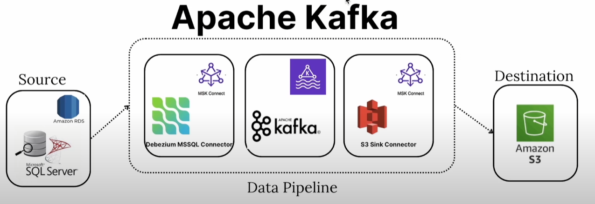

# Amnazon Managed Streaming for Apache Kafka

# AWS-Config rules recommended for each project 
This section provides list of recommended AWS Config rules for each project and also general-purpose on network/account level.

(see [AWS Config](AWS-Config/)).

# Load-Balancing 
Simple project to showcases ECS cluster running container tasks exposed via load balancer 443 port using custom CA certificate stored in AWS Private Certificate Authority and custom SSL certificate generated for Load Balancer. Load Balancer of type Application has Web Application Firewall (AWS WAF) and CloudFront distribution enabled custom security group.
(see [Load-Balancing](Load-Balancing/)).

# Transit-Gateway
Explaination of inter-VPC and inter-Account traffic routing inside AWS.
(see [Transit-Gateway](Transit-Gateway/)).

# CI-CD on AWS project
This project implements a comprehensive CI/CD infrastructure on AWS using Infrastructure as Code (Terraform) to orchestrate and manage multiple application pipelines. It supports building, testing, and deploying both Java-based and Docker container–based applications into AWS ECS (using blue/green deployments), as well as provisioning and managing related AWS resources like EKS clusters, ALBs, and IAM roles and policies.

(see [AWS CICD Project](eks-project/)).

# EKS project
This project exemplifies a comprehensive AWS solution focused around provisioning a private, production-ready Kubernetes cluster, configuring a load balancer for external access, and establishing detailed monitoring—come together to deliver a resilient and scalable infrastructure using best practices in Infrastructure as Code.

(see [AWS EKS Project](eks-project/)).

# Serverless data analytics project
This project orchestrates a serverless data processing workflow using AWS Step Functions, Lambda functions, AWS Glue, and other AWS services—all provisioned and managed by Terraform. Project simulates micro-transaction processing. Project implements serverless workflow with multiple lambda functions, glue jobs and different AWS databases for different use-cases.

New Transaction is an entry for StepFunctions workflow of JSON Payload that simulates single micro-transaction.
(see [AWS Serverless-StepFunctions Project](serverless-stepfunctions/)).