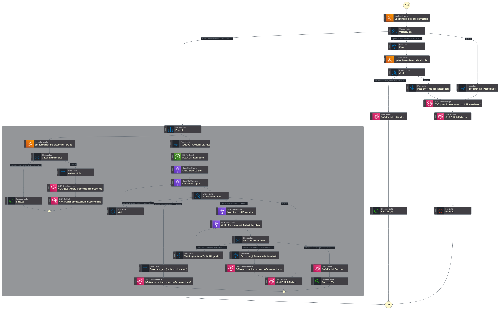

# Serverless data analytics project
This project orchestrates a serverless data processing workflow using AWS Step Functions, Lambda functions, AWS Glue, and other AWS services—all provisioned and managed by Terraform. Project simulates micro-transaction processing. Project implements serverless workflow with multiple lambda functions, glue jobs and different AWS databases for different use-cases.

New Transaction is an entry for StepFunctions workflow of following JSON Payload:
```
{ 
    "transactionId": "1",
    "user_id": "user_987654321",
    "game": "Path Of Exile 2",
    "item_purchased": {
        "item_id": "mtx_abyssal_wings",
        "item_name": "Abyssal Wings",
        "item_type": "cosmetic",
        "price": {
            "currency": "USD",
             "amount": 10
            }
        },
    "payment_details": {
        "payment_method": "credit_card",
        "card_last4": "1234",
        "transaction_status": "pending",
        "gateway": "Stripe"
    },
    "event_timestamp": "2025-02-09T12:34:56Z",
    "server_region": "EU-West",
    "client_ip": "192.168.1.1"
}
```


- **StepFunctions diagram/**



- **AWS Services used**:  
  Provisions the core AWS resources:
  - **Step Functions State Machine:** Main AWS Service that manages whole workflow of transaction processing simulation.
  - **API Gateway:** Configured to trigger the Step Functions workflow.
  - **Lambda Functions:**  ItemshopCheckLambda.py checks for informations about "item" in DynamoDB/RDS. RDSIngestionLambda writes transaction payload into RDS database for storage and compliance.
  - **DynamoDB Table:** Used for storing inventory or item data and checking if a file can be purchased.
  - **RDS Table:** Used to store all successfull transactional data for compliance.
  - **DynamoDB Table:** Used to store all successfull transactional data (without sensitive informations) for analytics purpose.
  - **SQS Queue and SNS Topic:** Provide error handling (SQS stores unsuccessfull transactions for further analysis) and notification (SNS) mechanisms.
  - **AWS Glue Crawler:** Reads transactional data from S3 (payment sensitive information is removed) and writes data to AWS Data Catalog Database Table
  - **AWS Glue Job:** Reads data from Data Catalog Database Table, processes Nested JSON and puts data into Redshift (for analytics purpose)

---

Practices worth mentioning:

- Throughout the workflow, multiple Pass states and error branches ensure that any failure (whether in validating data, writing to RDS, or ingesting via Glue) is properly captured. 
- Multiple "validation" stages are in-place to make sure data flows in proper JSON format for further processing. 
- Parallel processing was implemented with proper error-handling in order to finish both branches of workflow (one branch saves transactional data into RDS and second one removes sensitive data and saves data into Redshift for analytics purpose)
- For Lambda fetching secret to RDS connection dedicated "get_secret()" function is used in order to retrieve credentials in a secure manner.
- For each error path, the following actions are taken:
    Error details are attached to the transaction.
    The transaction is sent to an SQS queue for unsuccessful transactions.
    An SNS alert is issued, notifying the downstream systems or administrators of the failure.
- Ultimately, if errors occur that can’t be auto-recovered, the workflow terminates with a Fail state to indicate a DataValidationError.
